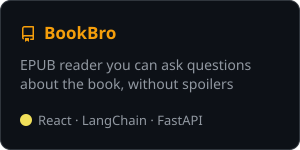
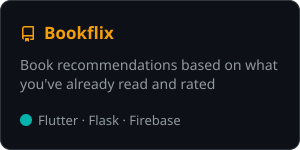

<!-- HEADER:START -->
<picture>
  <source media="(prefers-color-scheme: dark)" srcset="assets/header-dark-cd47bc61.svg">
  
</picture>

<a href="https://github.com/Isha1218/Isha1218/issues/new?title=feed+the+penguin+%F0%9F%90%9F&body=Just+click+Create.+The+penguin+eats+in+about+30+seconds+and+this+issue+closes+itself."><picture><source media="(prefers-color-scheme: dark)" srcset="assets/feed-dark-cd47bc61.svg"></picture></a>
<!-- HEADER:END -->

 

  
  
  

<a href="https://www.linkedin.com/in/ishita-mundra">linkedin</a> &nbsp;·&nbsp; <a href="mailto:ishita.mundra@gmail.com">email</a>
