  

I build apps that make things people already love a little smarter, mostly **books**. My ebook readers explain who a character is without spoiling what comes next ([BookBro](https://github.com/Isha1218/BookBroApp)), and let you text the characters themselves ([Inkborne](https://github.com/Isha1218/Inkborne)). When I'm not teaching books to talk back, I build for the planet and for people's quieter problems.

**usually found in:** Flutter · Python · TypeScript · Swift · RAG pipelines · a very long reading list

 

## 🐧 meet pip

pip lives on this profile and survives entirely on snacks from visitors. every button below opens a GitHub issue. hit **Submit** and a GitHub Action feeds pip, redraws it, and closes your issue with a thank-you and a penguin fact. feed pip enough and it levels up.

<!-- PIP:IMG:START -->

<!-- PIP:IMG:END -->

  
  
  
  

**recent snacks**
<!-- PIP:LOG:START -->
- `2026-09-27` 🐟 **@Isha1218** gave Pip a fish
<!-- PIP:LOG:END -->

**top feeders:**
<!-- PIP:BOARD:START -->
🥇 **@Isha1218** (1)
<!-- PIP:BOARD:END -->

pip's evolution chart

| snacks | level | pip gets |
|---:|---|---|
| 0 | hatchling | a dream |
| 5 | waddler | a red scarf |
| 15 | ice explorer | a beanie |
| 40 | floe captain | sunglasses |
| 100 | emperor | the crown |

 

## 📚 the iceberg library

  

**for readers**
- [**BookBro**](https://github.com/Isha1218/BookBroApp): an AI reading companion. Look up any character, place or event, spoiler-free, based on exactly where you are in the book.
- [**Inkborne**](https://github.com/Isha1218/Inkborne): upload an EPUB, then text its main characters. BookNLP finds them; RAG + Mistral-Instruct keeps them in character.
- [**Smart Ebook Reader**](https://github.com/Isha1218/Smart-Ebook-Reader): an EPUB reader that helps you understand and engage with a story on a deeper level.
- [**Bookflix**](https://github.com/Isha1218/bookflix): personal book recommendations based on what you've already read.

**for the planet**
- [**Aftertaste**](https://github.com/Isha1218/aftertaste): snap a dish or scan a barcode to see its CO₂, land and water footprint, ingredient by ingredient. Flutter + Flask.
- [**Upcycle AI**](https://github.com/Isha1218/Upcycle-AI): photograph something you were about to throw out. Gemini Vision spots its reusable parts, then suggests upcycling projects with difficulty, tools and steps. Expo + FastAPI, still on the workbench 🔨

**for people**
- [**Idle Hands**](https://github.com/Isha1218/idle_hands): watches your webcam with MediaPipe and nudges you when you start picking or biting without realizing.
- [**Hey Ollie**](https://github.com/Isha1218/Hey-Ollie): a chat-based travel planner.
- [**Vertex**](https://github.com/Isha1218/vertex): keeps students, teachers and parents in one conversation.

 

everything here is hand-drawn SVG and a small GitHub Action. no real penguins were fed in the making of this profile.

