  

### `~/experience`

**Affirm** · Software Engineer Intern · summer 2026
 On the pricing platform. I built self-serve Airflow pipelines that attach pricing configs to ~2.5M merchants. They replaced a two-day manual job that used to need an on-call engineer. I also built a Protobuf/RPC validation service that catches broken financing bundles before a shopper ever sees the wrong terms, which protects about $200K a year in GMV.

**Chipp** · Software Engineer Intern · 2025–26
 A fintech startup. I shipped an identity-verification flow in Go, PostgreSQL and Plaid that has stopped $10K+ in fraud, and containerized our services on AWS as we grew past 3K users. I also turned a round of customer calls into push notifications and receipt scanning, which cut churn by 35%.

### `~/projects`

| | what it does | built with |
|---|---|---|
| [**BookBro**](https://github.com/Isha1218/BookBroApp) | An AI reading companion. Ask about any character or plot point and get a spoiler-free answer based on exactly where you are in the book. | React · FastAPI · LangChain · FAISS |
| [**Aftertaste**](https://github.com/Isha1218/aftertaste) | Snap a meal or scan a barcode to see its carbon, land and water footprint, ingredient by ingredient, using a segmentation model trained on 10K+ food photos. | Flutter · Flask · PyTorch |
| [**Bookflix**](https://github.com/Isha1218/bookflix) | Finds your next read from what you've already read and rated, so you don't spend an hour scrolling Goodreads. | Flutter · Flask · Firebase |

  
  

